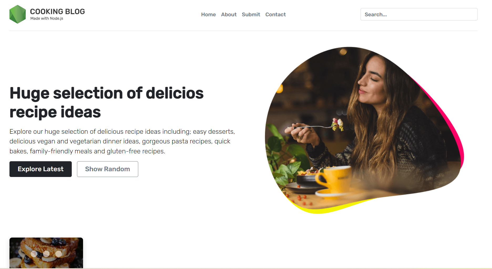

# Vaishnavi Recipe Discovery Platform 🍴

A modern, full-stack web application for discovering, sharing, and managing recipes. This platform allows users to browse recipes, search by name or category, and even submit their own recipes with images. Built with **Node.js**, **Express**, **MongoDB**, and **EJS**, it features a clean, responsive design powered by **Bootstrap 5**.

---

## 🔹 Project Overview

The **Vaishnavi Recipe Discovery Platform** is designed to make recipe exploration simple and fun:

- **Explore Recipes:** Browse latest, random, and categorized recipes.  
- **Search Recipes:** Find recipes by name or ingredients.  
- **Submit Recipes:** Users can submit new recipes with images.  
- **Responsive Design:** Works on desktop, tablet, and mobile devices.  

This project is ideal for beginners learning full-stack development, or for anyone who wants to create a personal recipe website.

---

## 🛠 Technologies Used

- **Node.js** – JavaScript runtime for the backend  
- **Express.js** – Web application framework  
- **MongoDB & Mongoose** – NoSQL database with schema modeling  
- **EJS** – Templating engine for dynamic HTML rendering  
- **Bootstrap 5** – Frontend framework for responsive design  
- **Nodemon** – Development tool for auto-reloading server  
- **Connect-Flash** – Display flash messages in the UI  
- **Express-FileUpload** – Handle image uploads 
## Project Structure 

📂 Vaishnavi-Recipe-Discovery-Platform/

├── 📂 server/

│   ├── 📂 controllers/

│   ├── 📂 models/

│   └── 📂 routes/

├── 📂 views/

├── 📂 public/

│   ├── 📂 css/

│   ├── 📂 js/

│   └── 📂 img/

├── 📄 app.js

├── 📄 package.json

└── 📄 .env

### Screenshots

### Screenshots

